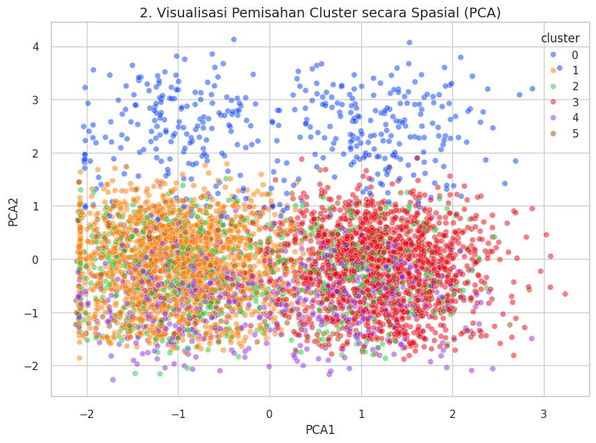

# 🌙 Sleep Health & Lifestyle Segmentation Analysis

## 📌 Deskripsi Proyek
Proyek ini menggunakan teknik **Unsupervised Learning** untuk mengidentifikasi segmen gaya hidup masyarakat berdasarkan kebiasaan sehari-hari dan dampaknya terhadap kualitas tidur. Dengan menggunakan **K-Means Clustering**, kita dapat membedakan pola perilaku antara kelompok yang memiliki kualitas tidur optimal dengan kelompok yang berisiko stres tinggi.

## 📂 Struktur Repositori
Penyusunan file dilakukan secara modular untuk memudahkan navigasi:
*   `data/`: Berisi dataset mentah (CSV).
*   `notebooks/`: File Jupyter Notebook (.ipynb) berisi langkah-langkah analisis mulai dari EDA hingga Clustering.
*   `images/`: Visualisasi hasil grafik yang dihasilkan dari analisis.
*   `output/`: Hasil akhir segmentasi berupa daftar anggota per cluster.

---

## 📊 Visualisasi & Insights

Berikut adalah beberapa poin kunci dari hasil analisis yang diambil dari folder `images/`:

### 1. Penentuan Jumlah Cluster (Elbow Method)

Menggunakan *KElbowVisualizer* untuk menentukan jumlah kelompok paling optimal. Berdasarkan grafik, ditemukan bahwa **K=6** adalah titik siku (*elbow*) terbaik.

### 2. Segmentasi Spasial (PCA)

Visualisasi sebaran data dalam ruang 2D setelah dilakukan reduksi dimensi menggunakan PCA untuk melihat seberapa baik cluster terpisah.

### 3. Profil Gaya Hidup (Radar Chart)

Setiap cluster memiliki karakteristik unik. Radar chart di bawah menunjukkan perbedaan dominan antara konsumsi kafein, langkah kaki, dan jam kerja antar cluster.

### 4. Dampak Terhadap Kesehatan Tidur

Analisis akhir menunjukkan bagaimana setiap gaya hidup cluster memengaruhi kualitas tidur dan tingkat stres.

---

## 🛠️ Metodologi & Fitur
- **Fitur yang Digunakan:** Kafein, Alkohol, *Screen Time*, Langkah Kaki, Olahraga, Jam Kerja, dan Status Shift.
- **Preprocessing:** Standardisasi skala data menggunakan `StandardScaler`.
- **Evaluasi:** Menggunakan *Silhouette Score* dan *Elbow Method*.
- **Tools:** `pandas`, `seaborn`, `scikit-learn`, `yellowbrick`, `plotly`.

## 🚀 Cara Penggunaan
1. Clone repositori ini.
2. Pastikan library sudah terinstall (`pip install pandas scikit-learn seaborn yellowbrick`).
3. Jalankan notebook di folder `notebooks/Sleep_Health_Lifestyle_Segmentation.ipynb`.
4. Hasil segmentasi tiap individu dapat ditemukan di folder `output/`.

## 🏁 Kesimpulan
Hasil clustering memberikan gambaran jelas bahwa **aktivitas fisik (steps)** dan **pembatasan screen time** adalah faktor pembeda utama bagi kelompok yang memiliki kualitas tidur terbaik. Wawasan ini dapat digunakan untuk memberikan rekomendasi gaya hidup sehat yang dipersonalisasi.

---
© 2025 [Annisa Tristanti]
